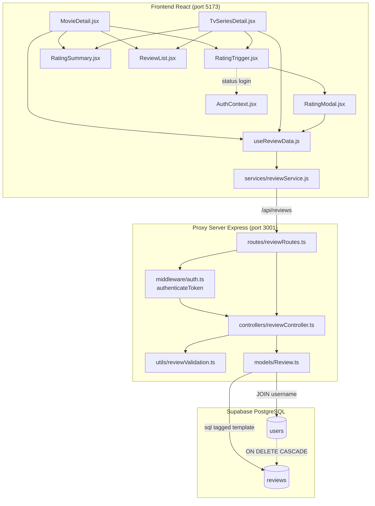
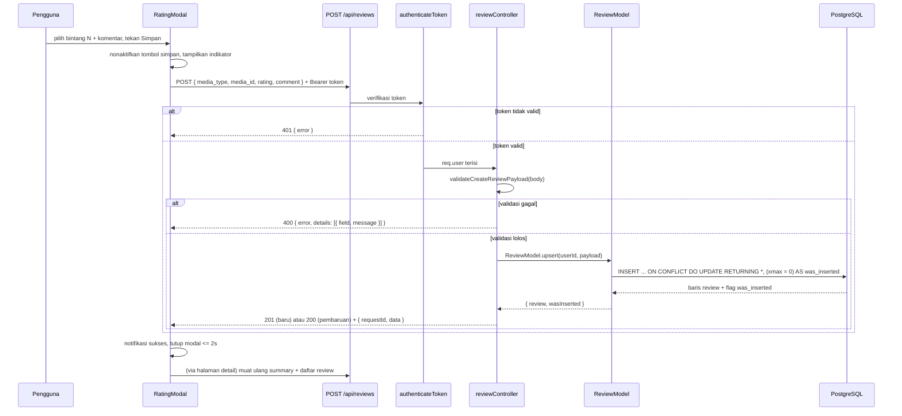
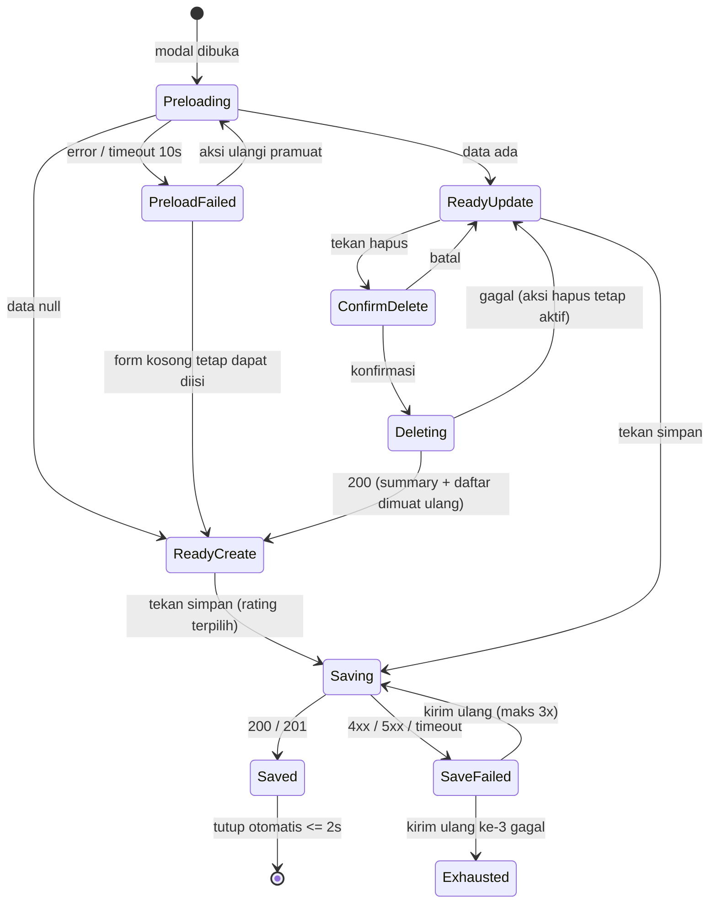

# Design Document

## Overview

Fitur ini menambahkan kemampuan rating (1–10) beserta komentar untuk film dan serial TV, dipicu oleh tombol "+" pada halaman detail frontend React, dengan penyimpanan permanen pada Supabase PostgreSQL.

Desain ini mengikuti pola arsitektur project yang sudah ada:

- **Backend**: `routes → controller → model` dengan model berbentuk static class, query melalui instance `sql` (postgres.js) dari `src/utils/database.ts`, tipe di `src/types/`, dan pendaftaran route pada Proxy_Server (`src/proxy-server.ts`, port 3001) di bawah prefix `/api`.
- **Autentikasi**: middleware `authenticateToken` yang sudah ada (`src/middleware/auth.ts`), yang mengisi `req.user` dari JWT.
- **Frontend**: React 17 + Vite, komponen di `frontend-react/src/components`, akses API melalui modul service di `frontend-react/src/services`, status login dari `AuthContext.jsx`.

Keputusan desain utama:

| Keputusan | Alasan |
| --- | --- |
| Satu tabel `reviews` dengan kolom pembeda `media_type` | Struktur data film dan serial identik; satu tabel menghindari duplikasi query, index, dan model (Req 11) |
| `media_id` sebagai `INT` biasa tanpa foreign key ke `movies` | Serial TV tidak punya baris di `movies`; FK akan menggagalkan penyimpanan review `tv` (Req 5.9) |
| Upsert dengan `INSERT ... ON CONFLICT ... DO UPDATE` | Menjamin satu review per pengguna per item media secara atomik, aman terhadap race condition (Req 5.5, 5.8) |
| Endpoint terdaftar pada Proxy_Server, bukan Auth Server | Data review adalah bagian dari domain media yang dilayani proxy; Auth Server tetap fokus pada identitas (Req 11.4) |
| Validasi payload memakai fungsi murni di `src/utils/reviewValidation.ts` | Req 3.10 menuntut satu entri kesalahan per field yang gagal, Req 3.6 menuntut pemangkasan sebelum diteruskan, dan fungsi murni membuat aturan validasi dapat diuji lewat property-based testing. `express-validator` tetap dipakai pada modul auth yang sudah ada |
| Agregat dihitung di database dengan `ROUND(AVG(rating)::numeric, 1)` | `ROUND` pada tipe `numeric` PostgreSQL membulatkan setengah menjauh dari nol, sesuai aturan "setengah ke atas" untuk nilai positif (Req 6.2) |
| Hitung `total` daftar review dengan query `COUNT(*)` terpisah dari query halaman | Window function `COUNT(*) OVER ()` tidak mengembalikan baris ketika halaman kosong, sehingga `total` akan salah saat `offset >= total` (Req 7.9) |

Catatan integrasi: Req 6.7 dan 6.8 menuntut Rating_Summary ditampilkan pada elemen terpisah dari skor TheMovieDB. Response detail saat ini (`modifyMovieResponse`, `tvSeriesDetailTypes`) belum memuat `vote_average`, sehingga desain ini menambahkan field `vote_average` pada kedua transformer detail agar skor TheMovieDB dapat ditampilkan berdampingan dengan rating pengguna aplikasi.

## Architecture

### Diagram komponen



### Alur simpan rating (upsert)



### Pembagian tanggung jawab lapisan

| Lapisan | Berkas | Tanggung jawab | Larangan |
| --- | --- | --- | --- |
| Routes | `src/routes/reviewRoutes.ts` | Memetakan path + metode HTTP ke handler, memasang `authenticateToken` pada endpoint yang memerlukan autentikasi | Tidak boleh ada SQL maupun logika validasi |
| Controller | `src/controllers/reviewController.ts` | Membaca `req.body`/`req.query`/`req.user`, memanggil validator, memanggil model, memetakan hasil ke status HTTP dan format response | Tidak boleh ada SQL |
| Validator | `src/utils/reviewValidation.ts` | Fungsi murni: normalisasi komentar, validasi payload simpan, parsing parameter daftar dan parameter media | Tidak boleh menyentuh `req`/`res` maupun database |
| Model | `src/models/Review.ts` | Satu-satunya lapisan yang mengeksekusi query, semua nilai disisipkan sebagai parameter tagged template | Tidak boleh menyentuh `req`/`res` |
| Tipe | `src/types/review.ts` | Interface Review_Record, Rating_Summary, payload request, dan hasil daftar | Tidak boleh memakai tipe `any` |
| Migrasi | `src/utils/database.ts` (`initializeDatabase`) | Membuat tabel, constraint, index, dan trigger secara idempoten | — |

Pendaftaran pada `src/proxy-server.ts`:

```typescript
import reviewRoutes from './routes/reviewRoutes';

app.use('/api/reviews', reviewRoutes);

// Handler khusus body JSON yang tidak dapat diurai (Req 3.11)
app.use((err: any, _req: Request, res: Response, next: NextFunction) => {
  if (err instanceof SyntaxError && 'body' in err) {
    res.status(400).json({ error: 'Request body must be valid JSON' });
    return;
  }
  next(err);
});
```

`frontend-react/vite.config.js` menambahkan entri proxy `'/api/reviews' → http://localhost:3001`.

## Components and Interfaces

### API Contract

Semua endpoint berada di bawah prefix tunggal `/api/reviews` pada Proxy_Server. Format response mengikuti konvensi project: sukses `{ requestId, data, ... }`, gagal `{ error }` atau `{ error, details }`.

#### 1. POST `/api/reviews` — buat atau perbarui review

- Auth: **wajib** (`authenticateToken`)
- Request body:

```json
{ "media_type": "movie", "media_id": 550, "rating": 9, "comment": "Sangat bagus" }
```

- `comment` opsional (boleh tidak disertakan atau `null`), dipangkas di server, string kosong setelah pemangkasan disimpan sebagai `null`.
- Field identifier pengguna pada body diabaikan tanpa error; pemilik selalu diambil dari `req.user.id` (Req 4.3).
- Response 201 (baris baru) / 200 (pembaruan):

```json
{
  "requestId": "e1c0…",
  "data": {
    "id": 12,
    "media_type": "movie",
    "media_id": 550,
    "rating": 9,
    "comment": "Sangat bagus",
    "created_at": "2025-01-05T09:00:00.000Z",
    "updated_at": "2025-01-05T09:00:00.000Z"
  }
}
```

- 400 `{ error: 'Validation failed', details: [{ field, message }] }` — satu entri per field yang gagal.
- 400 `{ error: 'Request body must be valid JSON' }` — body bukan JSON valid.
- 401 `{ error }` — token tidak ada, tidak berbentuk `Bearer <token>`, kedaluwarsa, atau pengguna sudah tidak ada.
- 500 `{ error: 'Failed to save review' }` — kegagalan query.

#### 2. GET `/api/reviews/me?media_type=&media_id=` — pramuat review sendiri

- Auth: **wajib**
- Response 200 ketika review ada: `{ requestId, data: { id, media_type, media_id, rating, comment, created_at, updated_at } }`
- Response 200 ketika review belum ada: `{ requestId, data: null }` (Req 8.9)
- 400 parameter tidak sah, 401 tanpa token valid, 500 kegagalan query.

#### 3. GET `/api/reviews/summary?media_type=&media_id=` — ringkasan rating

- Auth: **tidak diperlukan**; response identik baik tanpa header `Authorization`, dengan token tidak sah, maupun dengan token sah (Req 4.4).
- Response 200:

```json
{
  "requestId": "…",
  "data": { "media_type": "movie", "media_id": 550, "average_rating": 8.7, "review_count": 3 }
}
```

- Ketika belum ada review: `average_rating: null`, `review_count: 0`.
- 400 `{ error: 'Validation failed', details: [...] }` tanpa field `average_rating` dan `review_count` sama sekali pada body (Req 6.6).
- 500 `{ error: 'Failed to fetch rating summary' }`.

> Catatan: `average_rating` dan `review_count` ditempatkan di dalam `data` agar konsisten dengan format `{ requestId, data }` yang dipakai seluruh endpoint Proxy_Server (Req 11.8). Kedua field tetap merupakan bagian dari body response sebagaimana dituntut Req 6.1.

#### 4. GET `/api/reviews?media_type=&media_id=&limit=&offset=` — daftar review

- Auth: **tidak diperlukan** (Req 4.4)
- `limit` default 10, rentang 1–50. `offset` default 0, rentang 0–999.999.999. String kosong diperlakukan sebagai tidak disertakan (Req 7.4).
- Response 200:

```json
{
  "requestId": "…",
  "data": [
    { "username": "budi", "rating": 9, "comment": "Bagus", "created_at": "…", "updated_at": "…" },
    { "username": "sari", "rating": 7, "comment": null, "created_at": "…", "updated_at": "…" }
  ],
  "total": 24,
  "limit": 10,
  "offset": 0,
  "count": 2
}
```

- Setiap elemen memuat **tepat lima field**: `username`, `rating`, `comment`, `created_at`, `updated_at`. Kolom `password` dan `email` tidak pernah dipilih pada query (Req 7.2, 7.8).
- Urutan: `updated_at DESC`, lalu `created_at DESC`, lalu `id DESC` sebagai kunci terakhir agar urutan deterministik (Req 7.3).
- 400 `{ error: 'Validation failed', details: [...] }` tanpa field `data` ketika `limit`/`offset`/`media_type`/`media_id` tidak sah (Req 7.6).
- 500 `{ error: 'Failed to fetch reviews' }`.

#### 5. DELETE `/api/reviews?media_type=&media_id=` — hapus review sendiri

- Auth: **wajib**
- Response 200: `{ requestId, data: { deleted: true, media_type, media_id } }`
- 404 `{ error: 'Review not found' }` ketika kombinasi `req.user.id` + `media_type` + `media_id` tidak memiliki baris (Req 9.3).
- 400 parameter tidak sah, 401 tanpa token valid, 500 kegagalan query.

#### 6. DELETE `/api/reviews/:id` — hapus review berdasarkan identifier

- Auth: **wajib**
- Digunakan untuk operasi hapus yang menunjuk Review_Record secara langsung. Model membaca kepemilikan terlebih dahulu, lalu:
  - 200 `{ requestId, data: { deleted: true, id } }` ketika `review.user_id === req.user.id`
  - 403 `{ error: 'You can only delete your own review' }` ketika pemiliknya berbeda, tanpa mengubah `rating`, `comment`, maupun `updated_at` baris tersebut (Req 4.5)
  - 404 `{ error: 'Review not found' }` ketika identifier tidak ada.

### Routes: `src/routes/reviewRoutes.ts`

```typescript
import { Router } from 'express';
import { authenticateToken } from '../middleware/auth';
import {
  upsertReviewHandler,
  getMyReviewHandler,
  getRatingSummaryHandler,
  getReviewListHandler,
  deleteMyReviewHandler,
  deleteReviewByIdHandler
} from '../controllers/reviewController';

const router = Router();

// Endpoint publik (baca)
router.get('/summary', getRatingSummaryHandler);
router.get('/', getReviewListHandler);

// Endpoint terproteksi
router.get('/me', authenticateToken, getMyReviewHandler);
router.post('/', authenticateToken, upsertReviewHandler);
router.delete('/', authenticateToken, deleteMyReviewHandler);
router.delete('/:id', authenticateToken, deleteReviewByIdHandler);

export default router;
```

Urutan pendaftaran menempatkan `/summary` dan `/me` sebelum `/:id` agar tidak tertangkap route parameter.

### Validator: `src/utils/reviewValidation.ts`

Semua fungsi murni, tanpa akses `req`/`res`/database.

```typescript
export const COMMENT_MAX_LENGTH = 1000;
export const MEDIA_ID_MAX = 2147483647;
export const LIMIT_MIN = 1;
export const LIMIT_MAX = 50;
export const OFFSET_MAX = 999999999;
export const DEFAULT_LIMIT = 10;
export const DEFAULT_OFFSET = 0;

export interface ValidationError {
  field: string;
  message: string;
}

export type ValidationResult<T> =
  | { valid: true; value: T }
  | { valid: false; errors: ValidationError[] };

// Memangkas spasi/tab/baris baru di kedua ujung; string kosong → null
export function normalizeComment(comment: unknown): string | null;

// Validasi body POST: rating, media_type, media_id, comment
// Mengumpulkan SEMUA field yang gagal (Req 3.10)
export function validateCreateReviewPayload(body: unknown): ValidationResult<CreateReviewPayload>;

// Validasi media_type + media_id dari query string
export function validateMediaParams(query: unknown): ValidationResult<MediaRef>;

// Validasi media_type + media_id + limit + offset, dengan nilai bawaan
export function validateListParams(query: unknown): ValidationResult<ReviewListParams>;
```

Aturan validasi:

| Field | Aturan | Pesan gagal |
| --- | --- | --- |
| `rating` | wajib, bilangan bulat, 1–10 | `rating must be an integer between 1 and 10` |
| `media_type` | wajib, tepat string `movie` atau `tv` (peka huruf besar-kecil) | `media_type must be either "movie" or "tv"` |
| `media_id` | wajib, bilangan bulat, 1–2147483647 | `media_id must be an integer between 1 and 2147483647` |
| `comment` | opsional; jika ada harus `string` atau `null`; panjang ≤ 1000 setelah pemangkasan | `comment must be a string of at most 1000 characters` |
| `limit` | opsional; bilangan bulat 1–50; default 10 | `limit must be an integer between 1 and 50` |
| `offset` | opsional; bilangan bulat 0–999999999; default 0 | `offset must be an integer between 0 and 999999999` |

Field selain di atas pada body (termasuk `user_id`) diabaikan tanpa menghasilkan error (Req 4.3).

### Controller: `src/controllers/reviewController.ts`

Pola handler mengikuti konvensi project: `async (req, res): Promise<void>`, try-catch, log ke console, pesan error generik ke client.

```typescript
export const upsertReviewHandler = async (
  req: AuthenticatedRequest,
  res: Response
): Promise<void> => {
  try {
    const result = validateCreateReviewPayload(req.body);
    if (!result.valid) {
      res.status(400).json({ error: 'Validation failed', details: result.errors });
      return; // Model tidak dipanggil sama sekali (Req 3.9)
    }

    const userId = req.user!.id; // selalu dari token, bukan body (Req 4.3)
    const { review, wasInserted } = await ReviewModel.upsert(userId, result.value);

    res.status(wasInserted ? 201 : 200).json({
      requestId: randomUUID(),
      data: review
    });
  } catch (error: any) {
    console.error('Upsert review error:', error);
    res.status(500).json({ error: 'Failed to save review' });
  }
};
```

Tanggung jawab per handler:

| Handler | Validator | Model | Status sukses |
| --- | --- | --- | --- |
| `upsertReviewHandler` | `validateCreateReviewPayload` | `ReviewModel.upsert` | 201 baru / 200 pembaruan |
| `getMyReviewHandler` | `validateMediaParams` | `ReviewModel.findByUserAndMedia` | 200 (`data` bisa `null`) |
| `getRatingSummaryHandler` | `validateMediaParams` | `ReviewModel.getSummary` | 200 |
| `getReviewListHandler` | `validateListParams` | `ReviewModel.listByMedia` | 200 |
| `deleteMyReviewHandler` | `validateMediaParams` | `ReviewModel.deleteByUserAndMedia` | 200, atau 404 bila `deletedCount === 0` |
| `deleteReviewByIdHandler` | id numerik dari `req.params` | `ReviewModel.findById` + `ReviewModel.deleteById` | 200, 403 pemilik berbeda, 404 tidak ada |

### Model: `src/models/Review.ts`

Static class, seluruh query memakai tagged template `sql` dari `src/utils/database.ts`.

```typescript
export class ReviewModel {
  // Upsert atomik: satu statement, aman terhadap dua permintaan bersamaan (Req 5.5, 5.8)
  static async upsert(
    userId: number,
    payload: CreateReviewPayload
  ): Promise<{ review: ReviewRecord; wasInserted: boolean }> {
    const { media_type, media_id, rating, comment } = payload;

    const [row] = await sql`
      INSERT INTO reviews (user_id, media_type, media_id, rating, comment)
      VALUES (${userId}, ${media_type}, ${media_id}, ${rating}, ${comment})
      ON CONFLICT (user_id, media_type, media_id)
      DO UPDATE SET
        rating = EXCLUDED.rating,
        comment = EXCLUDED.comment,
        updated_at = NOW()
      RETURNING id, media_type, media_id, rating, comment, created_at, updated_at,
                (xmax = 0) AS was_inserted
    `;

    const { was_inserted, ...review } = row as ReviewRecord & { was_inserted: boolean };
    return { review: review as ReviewRecord, wasInserted: was_inserted };
  }

  static async findByUserAndMedia(
    userId: number,
    media: MediaRef
  ): Promise<ReviewRecord | null> {
    const rows = await sql`
      SELECT id, media_type, media_id, rating, comment, created_at, updated_at
      FROM reviews
      WHERE user_id = ${userId}
        AND media_type = ${media.media_type}
        AND media_id = ${media.media_id}
    `;
    return rows.length > 0 ? (rows[0] as unknown as ReviewRecord) : null;
  }

  // Agregat: rata-rata dibulatkan 1 desimal (setengah menjauh dari nol pada numeric)
  static async getSummary(media: MediaRef): Promise<RatingSummary> {
    const [row] = await sql`
      SELECT
        ROUND(AVG(rating)::numeric, 1) AS average_rating,
        COUNT(*)::int                  AS review_count
      FROM reviews
      WHERE media_type = ${media.media_type} AND media_id = ${media.media_id}
    `;

    return {
      media_type: media.media_type,
      media_id: media.media_id,
      // AVG mengembalikan NULL ketika tidak ada baris (Req 6.4)
      average_rating: row.average_rating === null ? null : Number(row.average_rating),
      review_count: Number(row.review_count)
    };
  }

  // Dua query: total tidak boleh terpengaruh limit/offset dan harus benar
  // walaupun halaman kosong (Req 7.7, 7.9)
  static async listByMedia(params: ReviewListParams): Promise<ReviewListResult> {
    const { media_type, media_id, limit, offset } = params;

    const [countRow] = await sql`
      SELECT COUNT(*)::int AS total
      FROM reviews
      WHERE media_type = ${media_type} AND media_id = ${media_id}
    `;

    const items = await sql`
      SELECT u.username, r.rating, r.comment, r.created_at, r.updated_at
      FROM reviews r
      INNER JOIN users u ON u.id = r.user_id
      WHERE r.media_type = ${media_type} AND r.media_id = ${media_id}
      ORDER BY r.updated_at DESC, r.created_at DESC, r.id DESC
      LIMIT ${limit} OFFSET ${offset}
    `;

    return {
      items: items as unknown as ReviewListItem[],
      total: Number(countRow.total),
      limit,
      offset
    };
  }

  static async deleteByUserAndMedia(userId: number, media: MediaRef): Promise<number> {
    const deleted = await sql`
      DELETE FROM reviews
      WHERE user_id = ${userId}
        AND media_type = ${media.media_type}
        AND media_id = ${media.media_id}
      RETURNING id
    `;
    return deleted.length;
  }

  static async findById(id: number): Promise<ReviewOwnerRecord | null> { /* SELECT id, user_id, … */ }

  static async deleteById(id: number, userId: number): Promise<number> { /* DELETE … WHERE id = … AND user_id = … */ }
}
```

Catatan `xmax = 0`: pada baris hasil `INSERT`, kolom sistem `xmax` bernilai 0; pada baris hasil `DO UPDATE`, `xmax` berisi id transaksi. Ini cara standar membedakan pembuatan dari pembaruan dalam satu statement upsert, sehingga controller dapat memilih 201 atau 200 tanpa query tambahan.

### Frontend

#### `frontend-react/src/services/reviewService.js`

Mengikuti gaya `movieService.js` (fetch, base URL relatif agar melalui proxy Vite), ditambah batas waktu 10 detik dengan `AbortController` (Req 8.6, 10.5).

```javascript
const API_BASE_URL = '/api/reviews';
const REQUEST_TIMEOUT_MS = 10000;

export const getReviewSummary = async (mediaType, mediaId) => { /* GET /summary */ };
export const getReviews = async (mediaType, mediaId, limit = 10, offset = 0) => { /* GET / */ };
export const getMyReview = async (mediaType, mediaId) => { /* GET /me + Bearer */ };
export const saveReview = async ({ mediaType, mediaId, rating, comment }) => { /* POST / + Bearer */ };
export const deleteMyReview = async (mediaType, mediaId) => { /* DELETE / + Bearer */ };
```

Setiap fungsi:
- menambahkan header `Authorization: Bearer <token>` dari `authService.getToken()` pada endpoint terproteksi;
- membaca body JSON, dan pada `!response.ok` melempar error yang membawa `status` serta `message` dari field `error` (atau pesan umum bila body tidak memuat `error`/tidak dapat diurai, Req 10.4);
- membatalkan permintaan setelah 10 detik dan melempar error bertanda `timeout`.

#### Komponen

| Komponen | Berkas | Peran |
| --- | --- | --- |
| `RatingTrigger` | `components/RatingTrigger.jsx` | Tombol "+" pada blok informasi utama. `aria-label` berisi aksi memberi rating + judul media, dapat diaktifkan via klik, Enter, dan Space, nonaktif selama `loading` AuthContext, dan menampilkan pesan berisi tautan `/login` ketika ditekan oleh pengguna belum login (Req 1.3, 1.6, 1.7) |
| `RatingModal` | `components/RatingModal.jsx` | 10 kontrol bintang, teks `N/10`, textarea komentar dengan pencacah karakter dan batas keras 1000, tombol simpan/hapus, konfirmasi hapus, area notifikasi (maks 5 butir), penutupan via tombol tutup dan Escape dengan pengembalian fokus ke trigger |
| `RatingSummary` | `components/RatingSummary.jsx` | Menampilkan `average_rating` format `N,N/10` + `review_count` di bawah label rating pengguna aplikasi, terpisah dari elemen skor TheMovieDB; menampilkan teks "belum ada rating pengguna" saat `review_count === 0`; menampilkan aksi muat ulang saat gagal |
| `ReviewList` | `components/ReviewList.jsx` | Daftar review dengan indikator proses, aksi "Muat lebih banyak" (tampil hanya ketika `loaded < total`), dan aksi coba lagi saat gagal |
| `useReviewData` | `hooks/useReviewData.js` | Hook bersama untuk `MovieDetail.jsx` dan `TvSeriesDetail.jsx`: state `summary`, `reviews`, `total`, `loading`, `error`, serta aksi `refreshSummary`, `loadFirstPage`, `loadMore`, `refreshAll` |

`MovieDetail.jsx` memakai `mediaType = 'movie'` dan judul `movie.title`; `TvSeriesDetail.jsx` memakai `mediaType = 'tv'` dan judul `tvSeries.name`. Keduanya hanya merender `RatingTrigger`, `RatingSummary`, dan `ReviewList` setelah data detail berhasil dimuat, sehingga saat `error` detail tidak ada trigger yang tampil (Req 1.8).

#### State mesin RatingModal



## Data Models

### Tipe TypeScript: `src/types/review.ts`

```typescript
export type MediaType = 'movie' | 'tv';

export interface MediaRef {
  media_type: MediaType;
  media_id: number;
}

export interface ReviewRecord {
  id: number;
  media_type: MediaType;
  media_id: number;
  rating: number;
  comment: string | null;
  created_at: Date;
  updated_at: Date;
}

// Dipakai internal untuk pemeriksaan kepemilikan
export interface ReviewOwnerRecord extends ReviewRecord {
  user_id: number;
}

export interface CreateReviewPayload {
  media_type: MediaType;
  media_id: number;
  rating: number;
  comment: string | null;
}

export interface RatingSummary {
  media_type: MediaType;
  media_id: number;
  average_rating: number | null;
  review_count: number;
}

// Tepat lima field identitas publik (Req 7.2, 7.8)
export interface ReviewListItem {
  username: string;
  rating: number;
  comment: string | null;
  created_at: Date;
  updated_at: Date;
}

export interface ReviewListParams extends MediaRef {
  limit: number;
  offset: number;
}

export interface ReviewListResult {
  items: ReviewListItem[];
  total: number;
  limit: number;
  offset: number;
}
```

### Skema tabel `reviews`

```sql
CREATE TABLE IF NOT EXISTS reviews (
  id         SERIAL PRIMARY KEY,
  user_id    INT NOT NULL REFERENCES users(id) ON DELETE CASCADE,
  media_type VARCHAR(10) NOT NULL,
  media_id   INT NOT NULL,
  rating     SMALLINT NOT NULL,
  comment    VARCHAR(1000),
  created_at TIMESTAMP DEFAULT NOW(),
  updated_at TIMESTAMP DEFAULT NOW(),
  CONSTRAINT reviews_media_type_check CHECK (media_type IN ('movie', 'tv')),
  CONSTRAINT reviews_media_id_check   CHECK (media_id > 0),
  CONSTRAINT reviews_rating_check     CHECK (rating BETWEEN 1 AND 10),
  CONSTRAINT reviews_user_media_key   UNIQUE (user_id, media_type, media_id)
);

CREATE INDEX IF NOT EXISTS idx_reviews_media ON reviews (media_type, media_id);
```

Penjelasan kolom dan constraint:

| Elemen | Alasan |
| --- | --- |
| `user_id … ON DELETE CASCADE` | Menghapus baris `users` otomatis menghapus seluruh review pengguna untuk kedua Media_Type (Req 9.5) |
| `media_type VARCHAR(10)` + `CHECK` | Diskriminator tipe media dengan dua nilai sah, ditegakkan di tingkat tabel |
| `media_id INT` tanpa foreign key | Serial TV tidak memiliki baris pada tabel `movies`, sehingga FK akan menolak review `tv` (Req 5.9) |
| `rating SMALLINT` + `CHECK (rating BETWEEN 1 AND 10)` | Tipe integer menolak nilai desimal, `CHECK` menolak nilai di luar 1–10 (Req 3.8) |
| `comment VARCHAR(1000)` nullable | Komentar opsional; batas panjang sejalan dengan validasi aplikasi (Req 3.5, 3.7) |
| `UNIQUE (user_id, media_type, media_id)` | Menjamin paling banyak satu review per pengguna per item media dan menjadi target `ON CONFLICT` (Req 5.5) |
| `idx_reviews_media` | Mendukung query daftar dan agregat per item media (Req 11.6) |

### Migrasi idempoten di `initializeDatabase()`

Ditambahkan setelah pembuatan tabel `movies`, mengikuti pola yang sudah ada:

```sql
-- Trigger auto-update updated_at, dibuat hanya jika belum terdaftar (Req 11.7, 11.9)
DO $$
BEGIN
  IF NOT EXISTS (SELECT 1 FROM pg_trigger WHERE tgname = 'update_reviews_updated_at') THEN
    CREATE TRIGGER update_reviews_updated_at
      BEFORE UPDATE ON reviews
      FOR EACH ROW
      EXECUTE FUNCTION update_updated_at_column();
  END IF;
END
$$;
```

Seluruh pernyataan memakai `CREATE TABLE IF NOT EXISTS`, `CREATE INDEX IF NOT EXISTS`, dan pemeriksaan `pg_trigger`, sehingga pemanggilan berulang tidak menghasilkan duplikat objek maupun mengubah data (Req 11.9). Kegagalan pada salah satu pernyataan melempar error ke pemanggil sehingga proses startup berhenti (Req 11.10), sama seperti perilaku `initializeDatabase` saat ini.

### Contoh isi tabel

| id | user_id | media_type | media_id | rating | comment | created_at | updated_at |
| --- | --- | --- | --- | --- | --- | --- | --- |
| 1 | 3 | movie | 550 | 9 | "Klasik" | 2025-01-05 09:00 | 2025-01-05 09:00 |
| 2 | 3 | tv | 1399 | 8 | NULL | 2025-01-05 09:05 | 2025-01-06 10:00 |
| 3 | 4 | movie | 550 | 7 | "Lumayan" | 2025-01-05 11:00 | 2025-01-05 11:00 |

Baris 1 dan 2 sah bersamaan karena `media_type` berbeda; baris 1 dan 3 sah karena `user_id` berbeda. Penyimpanan kedua oleh `user_id = 3` untuk `movie/550` akan memperbarui baris 1, bukan menambah baris.

## Correctness Properties

*Sebuah properti adalah karakteristik atau perilaku yang harus selalu benar pada seluruh eksekusi sah sebuah sistem — pada dasarnya pernyataan formal tentang apa yang seharusnya dilakukan sistem. Properti menjadi jembatan antara spesifikasi yang dapat dibaca manusia dan jaminan kebenaran yang dapat diverifikasi mesin.*

Fitur ini memuat banyak logika murni yang cocok untuk property-based testing: validasi dan normalisasi payload, semantik upsert, perhitungan agregat, paginasi, serta pemetaan state pada modal. Setelah refleksi untuk membuang properti yang saling menyubsumsi, tersisa 24 properti unik (13 backend, 11 frontend). Kriteria yang menguji constraint database, migrasi, dan organisasi kode dikeluarkan dari daftar ini dan ditangani sebagai integration/smoke test pada Testing Strategy.

**Backend**

### Property 1: Payload sah selalu diterima dan diteruskan apa adanya

*For any* payload dengan `rating` bilangan bulat 1–10, `media_type` bernilai `movie` atau `tv`, `media_id` bilangan bulat 1–2147483647, dan `comment` berupa string dengan panjang ≤ 1000 setelah pemangkasan atau tidak disertakan, validator harus mengembalikan hasil valid dengan nilai `rating`, `media_type`, dan `media_id` identik dengan masukan serta `comment` berupa hasil normalisasi masukan.

**Validates: Requirements 3.1**

### Property 2: Setiap field tidak sah menghasilkan tepat satu entri kesalahan dan model tidak dipanggil

*For any* payload yang memuat sebuah subset field tidak sah (tidak disertakan, null, tipe salah, bukan bilangan bulat, atau di luar rentang), himpunan `field` pada `details` harus sama dengan subset field tidak sah tersebut dengan setiap field muncul tepat sekali, response berstatus 400, dan Review_Model tidak pernah dipanggil.

**Validates: Requirements 3.2, 3.3, 3.4, 3.5, 3.9, 3.10**

### Property 3: Normalisasi komentar memangkas ujung dan mengubah komentar kosong menjadi null

*For any* nilai komentar masukan (string apa pun, `null`, atau tidak disertakan), hasil normalisasi tidak pernah berawalan atau berakhiran karakter spasi, tab, maupun baris baru; bernilai `null` tepat ketika masukan tidak disertakan, `null`, atau seluruhnya terdiri atas whitespace; dan normalisasi bersifat idempoten sehingga menormalisasi hasilnya kembali menghasilkan nilai yang sama.

**Validates: Requirements 3.6, 3.7**

### Property 4: Upsert memelihara satu review per pengguna per item media

*For any* barisan operasi simpan sah dari sekumpulan pengguna terhadap sekumpulan Media_Item (termasuk `media_type` bernilai `tv` dengan `media_id` yang tidak ada pada tabel `movies`), setelah setiap operasi berlaku: jumlah baris untuk setiap kombinasi (pemilik, `media_type`, `media_id`) paling banyak satu; `rating` dan `comment` baris tersebut sama dengan payload terakhir untuk kombinasi itu; pemilik selalu sama dengan `req.user.id` walaupun body memuat field identifier pengguna lain; `media_type`, `media_id`, dan `created_at` tidak pernah berubah setelah pembuatan; `updated_at` tidak pernah menurun; serta status response 201 pada operasi pertama untuk kombinasi tersebut dan 200 pada operasi berikutnya, dengan body memuat `id`, `media_type`, `media_id`, `rating`, `comment`, `created_at`, dan `updated_at`.

**Validates: Requirements 4.3, 5.1, 5.2, 5.3, 5.4, 5.5, 5.6, 5.9**

### Property 5: Simpan berulang dengan payload identik bersifat idempoten

*For any* payload simpan sah, menjalankan operasi simpan dua kali secara berurutan menghasilkan isi tabel yang sama dengan menjalankannya satu kali pada kolom `rating`, `comment`, `media_type`, `media_id`, `created_at`, dan jumlah baris.

**Validates: Requirements 5.7**

### Property 6: Ringkasan rating sama dengan perhitungan referensi

*For any* himpunan review dengan rating acak untuk sebuah Media_Item, `review_count` harus sama dengan jumlah review pada himpunan tersebut dan `average_rating` harus sama dengan rata-rata aritmetika rating yang dibulatkan ke satu angka desimal dengan pembulatan setengah ke atas; ketika himpunan kosong, `average_rating` bernilai null dan `review_count` bernilai 0; ketika himpunan tidak kosong, `average_rating` berada pada rentang 1.0–10.0 dengan paling banyak satu angka desimal.

**Validates: Requirements 6.1, 6.2, 6.3, 6.4, 6.5**

### Property 7: Daftar review konsisten terhadap paginasi, urutan, dan bentuk elemen

*For any* himpunan review acak untuk sebuah Media_Item dan setiap kombinasi `limit` (1–50) dan `offset` (0–999999999) yang sah, response memenuhi: jumlah elemen sama dengan `min(limit, max(0, total - offset))`; `total` sama dengan jumlah keseluruhan review untuk Media_Item tersebut tanpa dipengaruhi `limit` maupun `offset`; elemen terurut menurun berdasarkan `updated_at` lalu `created_at`; dua permintaan dengan parameter identik menghasilkan urutan identik; setiap elemen memiliki tepat lima field `username`, `rating`, `comment`, `created_at`, `updated_at` dengan `comment` bernilai null bila tersimpan tanpa komentar; dan serialisasi response tidak memuat nilai `password` maupun `email` pemilik.

**Validates: Requirements 7.2, 7.3, 7.5, 7.7, 7.8, 7.9**

### Property 8: Parsing parameter query menerapkan nilai bawaan dan menolak nilai di luar rentang

*For any* kombinasi parameter query, parser mengembalikan `limit` 10 dan `offset` 0 tepat ketika parameter tersebut tidak disertakan atau berupa string kosong; mengembalikan hasil gagal berisi entri kesalahan untuk setiap parameter yang bukan bilangan bulat, negatif, atau di luar rentang yang diizinkan walaupun parameter lain sah; dan pada kegagalan response berstatus 400 tanpa memuat field `data`, `average_rating`, maupun `review_count`.

**Validates: Requirements 6.6, 7.4, 7.6**

### Property 9: Penghapusan review sendiri bersifat round-trip terbalik

*For any* himpunan review acak, menghapus review milik seorang pengguna untuk sebuah Media_Item menghasilkan status 200 dengan field data, membuat permintaan pramuat berikutnya untuk kombinasi tersebut mengembalikan null, mengurangi jumlah baris tepat satu, dan tidak mengubah review lain; sementara permintaan hapus pada kombinasi yang tidak memiliki baris menghasilkan status 404 dengan field `error` dan isi tabel tidak berubah.

**Validates: Requirements 9.2, 9.3**

### Property 10: Endpoint terproteksi menolak permintaan tanpa otorisasi sebelum validasi payload

*For any* endpoint yang memerlukan autentikasi (buat/perbarui, pramuat review sendiri, hapus) dan setiap header `Authorization` tidak sah (tidak disertakan, bukan bentuk `Bearer <token>`, token rusak, token kedaluwarsa, atau token yang merujuk pengguna yang barisnya sudah tidak ada), response berstatus 401 dengan field `error`, tanpa field data review, tanpa memanggil validator payload, dan tanpa perubahan pada isi tabel `reviews` — termasuk ketika payload permintaan juga tidak sah.

**Validates: Requirements 4.1, 4.2, 4.6, 4.7, 8.4**

### Property 11: Penghapusan oleh bukan pemilik ditolak dan baris tetap utuh

*For any* Review_Record milik seorang pengguna dan setiap pengguna terautentikasi lain, permintaan hapus berdasarkan identifier review menghasilkan status 403 dengan field `error`, dan nilai `rating`, `comment`, serta `updated_at` review tersebut identik dengan nilai sebelum permintaan.

**Validates: Requirements 4.5**

### Property 12: Endpoint baca menghasilkan response yang sama terlepas dari header autentikasi

*For any* Media_Item, permintaan Rating_Summary dan permintaan daftar Review_Record menghasilkan status 200 dan body identik (kecuali `requestId`) ketika dikirim tanpa header `Authorization`, dengan token tidak sah, dan dengan token sah.

**Validates: Requirements 4.4**

### Property 13: Response tidak pernah mencampur data dengan kesalahan maupun membocorkan detail teknis

*For any* endpoint Rating_API dan setiap masukan (sah, tidak sah, atau dengan kegagalan query yang disimulasikan), response sukses memuat field data tanpa field `error`, response gagal memuat field `error` tanpa field data, nilai `error` tidak memuat teks query SQL, nama tabel, maupun stack trace, dan isi tabel `reviews` pada kasus kegagalan identik dengan isi sebelum permintaan.

**Validates: Requirements 10.6, 11.8, 11.11**

**Frontend**

### Property 14: State kontrol bintang dan keaktifan tombol simpan konsisten

*For any* barisan pemilihan kontrol bintang, nilai rating aktif selalu sama dengan pilihan terakhir dan hanya ada satu nilai aktif; untuk nilai aktif N, kontrol bintang 1..N ditandai terpilih dan N+1..10 tidak terpilih serta teks numerik yang ditampilkan sama dengan `N/10`; dan tombol simpan aktif tepat ketika nilai rating aktif sudah ditetapkan, terlepas dari isi kolom komentar.

**Validates: Requirements 2.2, 2.3, 2.4, 2.9, 2.10, 2.11**

### Property 15: Pembatasan dan pencacahan teks pada modal

*For any* string masukan, fungsi pembatas komentar mengembalikan string yang identik dengan masukan bila panjangnya ≤ 1000 dan 1000 karakter pertama masukan bila lebih panjang, jumlah karakter yang ditampilkan selalu sama dengan panjang nilai kolom setelah pembatasan, dan fungsi pemformatan judul mengembalikan judul identik bila panjangnya ≤ 120 atau prefix judul disertai indikator pemotongan bila lebih panjang.

**Validates: Requirements 1.4, 2.6, 2.7, 2.8**

### Property 16: Respons pramuat dipetakan tepat ke state modal

*For any* respons pramuat, modal mengirim tepat satu permintaan pramuat dengan `media_type` dan `media_id` halaman aktif beserta header `Authorization: Bearer <token>`; ketika respons memuat review dengan rating N, kontrol bintang 1..N terpilih, nilai aktif N, label aksi pembaruan, dan kolom komentar berisi teks tersimpan dengan pencacah sesuai panjangnya atau kosong dengan pencacah 0 bila komentar null; dan selama permintaan berlangsung seluruh 10 kontrol bintang, kolom komentar, serta tombol simpan dalam keadaan nonaktif.

**Validates: Requirements 8.1, 8.2, 8.5, 8.7, 8.8**

### Property 17: Aktivasi Rating_Trigger konsisten pada semua metode masukan

*For any* Media_Item dan setiap metode aktivasi (klik, Enter, Space), Rating_Trigger memiliki `aria-label` yang memuat judul Media_Item; ketika status autentikasi masih diverifikasi trigger nonaktif dan tidak ada metode aktivasi yang membuka modal; ketika pengguna belum login tidak ada metode aktivasi yang membuka modal dan pesan wajib login beserta tautan ke halaman login ditampilkan; dan ketika pengguna terautentikasi setiap metode aktivasi menghasilkan state identik berupa modal terbuka dengan `media_type` dan `media_id` sama dengan halaman aktif.

**Validates: Requirements 1.2, 1.3, 1.6, 1.7**

### Property 18: Semua jalur penutupan modal ekuivalen

*For any* isi form (nilai rating dan komentar), penutupan melalui tombol tutup dan melalui tombol Escape menghasilkan state aplikasi identik: modal tersembunyi, masukan yang belum dikirim terbuang sehingga pembukaan berikutnya menampilkan form sesuai hasil pramuat, tidak ada permintaan ulang data detail Media_Item, dan fokus keyboard kembali ke Rating_Trigger.

**Validates: Requirements 1.5, 1.9**

### Property 19: Ringkasan dimuat ulang setelah setiap operasi tulis dan ditampilkan sesuai response terakhir

*For any* barisan operasi tulis yang berhasil (buat, perbarui, hapus), Detail_Page mengirim tepat satu permintaan Rating_Summary per operasi yang selesai, nilai yang ditampilkan berasal dari response Rating_Summary terakhir yang diterima dengan `average_rating` diformat `N,N/10` beserta `review_count` pada elemen yang terpisah dari elemen skor TheMovieDB, dan setelah operasi hapus yang berhasil daftar Review_Record dimuat ulang dengan `limit` 10 dan `offset` 0 serta modal kembali ke form kosong berlabel aksi pembuatan.

**Validates: Requirements 6.7, 6.9, 6.10, 9.4**

### Property 20: Paginasi daftar review pada Detail_Page

*For any* nilai `total` dan jumlah review yang sudah dimuat, aksi memuat review berikutnya tampil tepat ketika jumlah yang dimuat lebih kecil dari `total` dan permintaan berikutnya memakai `offset` sama dengan jumlah yang sudah dimuat; permintaan pertama setelah data detail dimuat memakai `limit` 10 dan `offset` 0; dan aksi coba lagi setelah kegagalan mengirim permintaan dengan parameter identik dengan permintaan yang gagal.

**Validates: Requirements 7.1, 7.11, 7.12, 7.13**

### Property 21: Paling banyak satu permintaan simpan aktif, dan sukses menutup modal

*For any* jumlah penekanan tombol simpan selama satu permintaan simpan belum selesai, service simpan terpanggil tepat satu kali dan tombol simpan beserta aksi hapus dalam keadaan nonaktif; dan untuk setiap status sukses (200 atau 201), indikator proses berhenti, notifikasi keberhasilan ditampilkan, dan modal tertutup paling lambat 2 detik setelah notifikasi tampil.

**Validates: Requirements 10.1, 10.2**

### Property 22: Isi form dipertahankan pada setiap kelas kegagalan

*For any* isi form (nilai rating dan komentar) dan setiap kelas kegagalan (status 400–499 selain 401, status 401, status 500–599, body error tanpa field `error` atau bukan JSON, kegagalan jaringan, serta tidak ada respons dalam 10 detik), modal tetap terbuka dengan nilai rating dan isi komentar identik dengan sebelum percobaan; pesan yang ditampilkan berasal dari field `error` bila tersedia dan berupa pesan umum bila tidak; tombol simpan aktif kembali kecuali pada status 401 yang menonaktifkannya dan menampilkan tautan ke halaman login; serta aksi kirim ulang tersedia pada kegagalan jaringan, batas waktu, dan status 500–599. Perilaku yang sama berlaku untuk kegagalan hapus dan kegagalan pramuat, yang mempertahankan aksi hapus tetap aktif dan menyediakan aksi ulangi.

**Validates: Requirements 6.11, 8.6, 9.8, 10.3, 10.4, 10.5, 10.7, 10.9**

### Property 23: Kirim ulang mengirim payload identik dengan batas tiga percobaan

*For any* payload simpan dan barisan kegagalan berulang, setiap kirim ulang membersihkan pesan kesalahan sebelumnya dan mengirim nilai rating serta komentar yang identik dengan percobaan pertama, jumlah kirim ulang untuk satu percobaan simpan tidak pernah melebihi 3, setelah kirim ulang ketiga gagal aksi kirim ulang tidak lagi ditampilkan dan pesan untuk mencoba kembali nanti tampil, dan jumlah butir pesan yang dirender pada satu area notifikasi sama dengan `min(jumlah pesan yang berlaku, 5)` dengan setiap butir merupakan salah satu pesan yang berlaku.

**Validates: Requirements 10.8, 10.10, 10.11**

### Property 24: Konfirmasi hapus menahan permintaan sampai dikonfirmasi

*For any* state modal, aksi hapus rating tampil aktif tepat ketika review milik pengguna untuk Media_Item tersebut ada; menekan aksi hapus menampilkan permintaan konfirmasi dengan aksi konfirmasi dan aksi batal tanpa mengirim permintaan hapus; dan memilih aksi batal tidak mengirim permintaan hapus serta mempertahankan nilai rating dan isi komentar yang sedang ditampilkan.

**Validates: Requirements 9.1, 9.6, 9.7**

## Error Handling

### Pemetaan kesalahan backend

| Kondisi | Status | Body | Catatan |
| --- | --- | --- | --- |
| Body bukan JSON valid | 400 | `{ error: 'Request body must be valid JSON' }` | Ditangani error middleware pada `proxy-server.ts` (Req 3.11) |
| Satu atau lebih field payload tidak sah | 400 | `{ error: 'Validation failed', details: [{ field, message }] }` | Satu entri per field, model tidak dipanggil (Req 3.9, 3.10) |
| Parameter query `media_type`/`media_id`/`limit`/`offset` tidak sah | 400 | `{ error: 'Validation failed', details: [...] }` | Tanpa field `data`, `average_rating`, `review_count` (Req 6.6, 7.6) |
| Token tidak ada / bukan Bearer / rusak / kedaluwarsa / pengguna tidak ada | 401 | `{ error: … }` dari `authenticateToken` | Middleware berjalan sebelum validasi (Req 4.2, 4.6, 4.7) |
| Hapus review milik pengguna lain | 403 | `{ error: 'You can only delete your own review' }` | Baris tidak diubah (Req 4.5) |
| Hapus review yang tidak ada | 404 | `{ error: 'Review not found' }` | (Req 9.3) |
| Kegagalan query database | 500 | `{ error: 'Failed to save review' }` / `'Failed to fetch reviews'` / `'Failed to fetch rating summary'` / `'Failed to delete review'` | `console.error` mencatat error asli; pesan client tidak memuat query, nama tabel, atau stack trace (Req 10.6, 11.8) |

Catatan implementasi:

- Setiap handler dibungkus `try-catch`; blok catch hanya mencatat ke `console.error` dan mengirim pesan generik.
- Karena setiap operasi tulis dieksekusi sebagai satu statement SQL tunggal (`INSERT ... ON CONFLICT` atau `DELETE ... RETURNING`), kegagalan tidak dapat menyisakan perubahan sebagian sehingga transaksi eksplisit tidak diperlukan (Req 11.11).
- Pelanggaran unique constraint tidak lagi mungkin muncul sebagai error `23505` pada operasi simpan karena `ON CONFLICT` menanganinya; jika tetap muncul (misalnya karena constraint lain), handler tetap merespons 500 dengan pesan generik.
- Constraint `CHECK` pada tabel adalah lapisan pertahanan kedua di belakang validasi aplikasi; pelanggaran hanya mungkin terjadi bila ada penulisan langsung ke database.

### Pemetaan kesalahan frontend

| Kondisi | Perilaku |
| --- | --- |
| Pramuat gagal (jaringan, status ≥ 400, atau > 10 detik) | Form kosong mode pembuatan + pesan pramuat gagal + aksi ulangi (Req 8.6) |
| Simpan gagal status 400–499 kecuali 401 | Modal tetap terbuka, pesan dari `error`, form dipertahankan, tombol simpan aktif kembali (Req 10.3) |
| Simpan gagal status 401 | Pesan login kembali + tautan `/login`, tombol simpan nonaktif, form dipertahankan (Req 10.7) |
| Simpan gagal status 500–599, jaringan, atau batas waktu 10 detik | Pesan gagal umum + aksi kirim ulang (maks 3 kali), form dipertahankan (Req 10.5, 10.9, 10.10, 10.11) |
| Body error tanpa field `error` atau bukan JSON | Pesan umum "gagal menyimpan rating", form dipertahankan (Req 10.4) |
| Summary gagal | Teks "ringkasan rating pengguna tidak tersedia" + aksi muat ulang; detail dan skor TheMovieDB tetap tampil (Req 6.11) |
| Daftar review gagal | Pesan kegagalan + aksi coba lagi dengan parameter sama; review yang sudah dimuat dipertahankan (Req 7.10, 7.11) |
| Hapus gagal | Pesan gagal hapus, aksi hapus tetap aktif, review dan isi form dipertahankan (Req 9.8) |

Semua permintaan frontend memakai `AbortController` dengan batas 10 detik. Area notifikasi modal merender paling banyak 5 butir pesan.

## Testing Strategy

### Perangkat uji

Project belum memiliki test runner, sehingga desain ini menambahkan:

| Kebutuhan | Pilihan | Alasan |
| --- | --- | --- |
| Test runner | `vitest` | Mendukung TypeScript tanpa konfigurasi tambahan dan berjalan pada workspace backend maupun frontend Vite yang sudah ada |
| Property-based testing | `fast-check` | Library PBT standar untuk ekosistem JavaScript/TypeScript; tidak ada implementasi PBT yang dibuat sendiri |
| Pengujian komponen React | `@testing-library/react` v12 + `@testing-library/user-event` + `jsdom` | Versi 12 kompatibel dengan React 17 yang dipakai frontend |
| Database uji | Skema terpisah pada Supabase atau PostgreSQL lokal, di-reset per suite | Integration test membutuhkan constraint dan trigger PostgreSQL nyata |

Perintah: `npm run test` (backend, `vitest --run`) dan `npm run test` pada `frontend-react` (`vitest --run`).

### Property-based tests

- Setiap Correctness Property diimplementasikan sebagai **satu** property test.
- Setiap property test dijalankan minimal **100 iterasi** (`fc.assert(..., { numRuns: 100 })`).
- Setiap test diberi komentar penanda dengan format:
  `// Feature: movie-rating-review, Property {number}: {property_text}`
- Generator wajib mencakup kasus batas: rating 1 dan 10 serta nilai tidak sah 0, 11, dan desimal; `media_id` 1 dan 2147483647; komentar panjang 0, 1, 1000, dan 1001 karakter; komentar berisi whitespace unicode, emoji, kutip tunggal, dan `--`; `limit` 1, 10, 50, 51; `offset` 0 dan 999999999; `total` 0 dan `offset >= total`; judul 119, 120, dan 121 karakter.
- Properti 1–3, 6–8, 14–15 diuji terhadap fungsi murni tanpa database.
- Properti 4, 5, 7, 9, 11–13 diuji terhadap **fake in-memory ReviewModel** yang menerapkan semantik unique constraint dan urutan, sehingga 100+ iterasi tetap murah; semantik nyata database diverifikasi terpisah oleh integration test.
- Properti 16–24 diuji pada level komponen dengan `@testing-library/react`, service termock, dan timer palsu untuk batas 2 detik dan 10 detik.

### Unit tests (contoh dan kasus batas)

- Body bukan JSON → 400 dengan field `error` (Req 3.11).
- Modal menampilkan tepat 10 kontrol bintang bernilai 1–10 urut naik (Req 2.1).
- Rating belum dipilih menampilkan penanda tanpa angka (Req 2.5).
- Pramuat mengembalikan `data: null` → form kosong, label pembuatan, tombol simpan nonaktif (Req 8.3).
- `review_count` 0 → teks belum ada rating pengguna, tanpa angka, skor TheMovieDB tetap tampil (Req 6.8).
- Pemuatan detail gagal atau media tidak ditemukan → tidak ada Rating_Trigger, pesan error tampil (Req 1.8).
- `initializeDatabase` gagal pada satu pernyataan → promise reject dan pernyataan berikutnya tidak dijalankan (Req 11.10).
- Rating_Trigger tampil setelah data detail berhasil dimuat (Req 1.1).

Jumlah unit test dijaga tetap kecil: cakupan kombinasi masukan menjadi tanggung jawab property test.

### Integration tests (database nyata, 1–3 contoh per kasus)

- Constraint tabel menolak `rating` 0, 11, dan desimal, serta isi tabel tidak berubah (Req 3.8).
- Dua upsert paralel untuk kombinasi (pengguna, `media_type`, `media_id`) yang sama menyisakan satu baris tanpa response 500 (Req 5.8).
- `DELETE` pada baris `users` menghapus seluruh review pengguna untuk `movie` dan `tv` melalui `ON DELETE CASCADE` (Req 9.5).
- `initializeDatabase` membuat tabel, unique constraint, default `created_at`/`updated_at`, index `idx_reviews_media`, dan trigger `update_reviews_updated_at` (Req 11.5, 11.6, 11.7).
- `initializeDatabase` dijalankan 3 kali berturut-turut tanpa error, tanpa duplikat objek, dan data review tetap utuh (Req 11.9).
- Trigger `BEFORE UPDATE` memperbarui `updated_at` pada pembaruan nyata (pendukung Req 5.6).

### Smoke tests dan pemeriksaan statis

- `npm run build` (tsc strict) lolos dan `src/types/review.ts` tidak memuat tipe `any` (Req 11.3).
- Pemeriksaan statis: tidak ada literal SQL pada `src/routes/reviewRoutes.ts` dan `src/controllers/reviewController.ts` (Req 11.1).
- Proxy Server merespons pada `/api/reviews` dan mengembalikan 404 untuk path review di luar prefix tersebut (Req 11.4, sekaligus dicakup Property 13).

### Kriteria yang tidak diuji otomatis

Batas waktu pada tingkat pengalaman pengguna dan karakteristik visual diverifikasi manual: tampilnya trigger dalam 500 ms tanpa perlu menggulir (Req 1.1), animasi buka/tutup modal 300 ms (Req 1.2, 1.5), pengaktifan kembali trigger dalam 300 ms (Req 1.7), dan batas 2 detik pada response Rating_Summary di lingkungan nyata (Req 6.1, 6.9).
